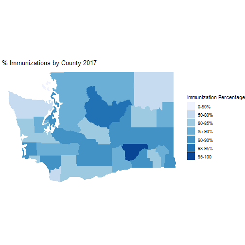

## Introduction


The domain we originally started with was vaccinations. This domain piqued our interest as it’s a public health area that’s currently been getting more coverage especially as groups of anti-vaxxers are on the rise and there is a strong push to get a vaccine for COVID-19. Vaccines are also a public health intervention that can prevent or provide protection against many infections and diseases.

The domain we narrowed our assignment to was vaccinations within K-12 schools in Washington State. The dataset we’re using to gain more insight on this issue within the state is the [WA State K-12 Immunization Data 2016-2017](https://catalog.data.gov/dataset/all-students-kindergarten-through-12th-grade-immunization-data-by-school-2016-2017). It includes all the schools within the state and information on items such as the school population, location, percentage of vaccination exemptions (and what kind), percentage of how many students have all vaccinations, and much more. The data was downloaded from Data.gov which is managed and hosted by the U.S. General Services Administration, Technology Transformation Service. The data’s metadata was last updated January 16, 2020. For our analysis, we have filtered out the schools who did not report their vaccination data.

## Enrollment and Vaccines


```
## Error in loadNamespace(name): there is no package called 'webshot'
```

A question we wanted to answer was “do larger schools have higher percentages of all vaccinations completed?” We thought that larger schools may push or require its families to vaccinate their children as disease could spread faster and impact more people due to a larger population that is typically in close contact. Before creating this plot, we found that the mean enrollment size in each school in the state  is 455.9301856 students and that the mean percentage complete for all vaccinations in the whole state is 85.350686. 

This plot compares the counties within the state and provides their average enrollments and average percent of having completed all vaccinations. The trendline shows that there is a slight positive correlation which can indicate that larger schools have more children who have received all vaccinations.

## Reasons for No Vaccination


```
## Error in loadNamespace(name): there is no package called 'webshot'
```

We wanted to know more about the distribution of the reasons for not vaccinating. We thought that if we knew the distribution, we would know where to best focus efforts in addressing the lack of vaccination.

This pie chart displays the count and percentage of the different reasons for not vaccinating. We can deduce that not vaccinating due to personal exemption makes up 71.6% (44,104 children) of the total number of children (61,598 children) who didn’t get vaccinated. We see that we should be focusing our efforts in targeting children who have personal exemptions.

## Immunization by County


To get a better grasp on the variation of immunization rates throughout the state we decided to map out the rates at which counties had immunizations based on data collected from those attending K-12 education. The percentage of immunizations were calculated by dividing the number of complete immunizations in students by the total number of students enrolled. 

This figure shows us the variation of rates amongst different counties in the state which may allow us to draw out some interesting insights. An important takeway that we wanted to highlight from the results of this figure is to be cognisant of population densities within these individual counties and how they may affect the overall percentage and rate at which immunizations are taken. 

## Immunization by District

Based on the data we have for WA state, we are also curious to see if there is a relationship between county and district in terms of immunization rates and population density. For example, King County consists of many school districts (i.e. Seattle, Issaquah, Federal Way, etc.), so if we were to take a look at the immunization rate for King County, the rates for the school districts, and the population density for each county, is there a trend? With this question, we also need to remember that the population not only consists of K-12 students, but infants, college students, adults, and the elderly as well. (Note: I have not reflected the population density into the visualizations yet. I am also still working on organizing the charts so they all don't show up at once. I have the input completed, but I'm having some struggles with the corresponding output.)

The following visualizations show the ratio of students who have recieved all immunizations to those who have not based on district. The percentage was calculated by taking the total number of students who have recieved all immunizations divided by the total number of students enrolled in each district. A similar plot based on the counties has been provided for reference. 

<!--html_preserve--><div class="form-group shiny-input-container">
<label class="control-label" for="County">Select County</label>
<div>
<select id="County"><option value="ADAMS" selected>ADAMS</option>
<option value="ASOTIN">ASOTIN</option>
<option value="BENTON">BENTON</option>
<option value="CHELAN">CHELAN</option>
<option value="CLALLAM">CLALLAM</option>
<option value="CLARK">CLARK</option>
<option value="COLUMBIA">COLUMBIA</option>
<option value="COWLITZ">COWLITZ</option>
<option value="DOUGLAS">DOUGLAS</option>
<option value="FERRY">FERRY</option>
<option value="FRANKLIN">FRANKLIN</option>
<option value="GARFIELD">GARFIELD</option>
<option value="GRANT">GRANT</option>
<option value="GRAYS HARBOR">GRAYS HARBOR</option>
<option value="ISLAND">ISLAND</option>
<option value="JEFFERSON">JEFFERSON</option>
<option value="KING">KING</option>
<option value="KITSAP">KITSAP</option>
<option value="KITTITAS">KITTITAS</option>
<option value="KLICKITAT">KLICKITAT</option>
<option value="LEWIS">LEWIS</option>
<option value="LINCOLN">LINCOLN</option>
<option value="MASON">MASON</option>
<option value="OKANOGAN">OKANOGAN</option>
<option value="PACIFIC">PACIFIC</option>
<option value="PEND OREILLE">PEND OREILLE</option>
<option value="PIERCE">PIERCE</option>
<option value="SAN JUAN">SAN JUAN</option>
<option value="SKAGIT">SKAGIT</option>
<option value="SKAMANIA">SKAMANIA</option>
<option value="SNOHOMISH">SNOHOMISH</option>
<option value="SPOKANE">SPOKANE</option>
<option value="STEVENS">STEVENS</option>
<option value="THURSTON">THURSTON</option>
<option value="WAHKIAKUM">WAHKIAKUM</option>
<option value="WALLA WALLA">WALLA WALLA</option>
<option value="WHATCOM">WHATCOM</option>
<option value="WHITMAN">WHITMAN</option>
<option value="YAKIMA">YAKIMA</option></select>
<script type="application/json" data-for="County" data-nonempty="">{}</script>
</div>
</div><!--/html_preserve--><!--html_preserve--><div id="out05c2439fb090a3e8" class="shiny-text-output"></div><!--/html_preserve--><!--html_preserve--><div class="col-sm-8">
<div id="htmlwidget-4a1e887bd2502dbd5f40" style="width:100%;height:400px;" class="plotly html-widget"></div>
<script type="application/json" data-for="htmlwidget-4a1e887bd2502dbd5f40">{"x":{"visdat":{"e98760c52eb":["function () ","plotlyVisDat"]},"cur_data":"e98760c52eb","attrs":{"e98760c52eb":{"x":{},"y":{},"text":{},"hoverinfo":"text","name":"Immunization Rate in each County","color":{},"alpha_stroke":1,"sizes":[10,100],"spans":[1,20],"type":"bar"}},"layout":{"margin":{"b":40,"l":60,"t":25,"r":10},"title":"Immunization Rate in each County","xaxis":{"domain":[0,1],"automargin":true,"title":"Students with Complete Immunization (%)"},"showlegend":false,"yaxis":{"domain":[0,1],"automargin":true,"title":"County","type":"category","categoryorder":"array","categoryarray":["ADAMS","ASOTIN","BENTON","CHELAN","CLALLAM","CLARK","COLUMBIA","COWLITZ","DOUGLAS","FERRY","FRANKLIN","GARFIELD","GRANT","GRAYS HARBOR","ISLAND","JEFFERSON","KING","KITSAP","KITTITAS","KLICKITAT","LEWIS","LINCOLN","MASON","OKANOGAN","PACIFIC","PEND OREILLE","PIERCE","SAN JUAN","SKAGIT","SKAMANIA","SNOHOMISH","SPOKANE","STEVENS","THURSTON","WAHKIAKUM","WALLA WALLA","WHATCOM","WHITMAN","YAKIMA"]},"hovermode":"closest"},"source":"A","config":{"showSendToCloud":false},"data":[{"x":[92.3374770735684],"y":["ADAMS"],"text":"ADAMS: 92.34%","hoverinfo":"text","name":"Immunization Rate in each County","type":"bar","orientation":"h","marker":{"color":"rgba(102,194,165,1)","line":{"color":"rgba(102,194,165,1)"}},"textfont":{"color":"rgba(102,194,165,1)"},"error_y":{"color":"rgba(102,194,165,1)"},"error_x":{"color":"rgba(102,194,165,1)"},"xaxis":"x","yaxis":"y","frame":null},{"x":[92.948717948718],"y":["ASOTIN"],"text":"ASOTIN: 92.95%","hoverinfo":"text","name":"Immunization Rate in each County","type":"bar","orientation":"h","marker":{"color":"rgba(144,186,152,1)","line":{"color":"rgba(144,186,152,1)"}},"textfont":{"color":"rgba(144,186,152,1)"},"error_y":{"color":"rgba(144,186,152,1)"},"error_x":{"color":"rgba(144,186,152,1)"},"xaxis":"x","yaxis":"y","frame":null},{"x":[87.7284672394957],"y":["BENTON"],"text":"BENTON: 87.73%","hoverinfo":"text","name":"Immunization Rate in each County","type":"bar","orientation":"h","marker":{"color":"rgba(175,178,140,1)","line":{"color":"rgba(175,178,140,1)"}},"textfont":{"color":"rgba(175,178,140,1)"},"error_y":{"color":"rgba(175,178,140,1)"},"error_x":{"color":"rgba(175,178,140,1)"},"xaxis":"x","yaxis":"y","frame":null},{"x":[93.2400761681559],"y":["CHELAN"],"text":"CHELAN: 93.24%","hoverinfo":"text","name":"Immunization Rate in each County","type":"bar","orientation":"h","marker":{"color":"rgba(200,169,128,1)","line":{"color":"rgba(200,169,128,1)"}},"textfont":{"color":"rgba(200,169,128,1)"},"error_y":{"color":"rgba(200,169,128,1)"},"error_x":{"color":"rgba(200,169,128,1)"},"xaxis":"x","yaxis":"y","frame":null},{"x":[72.1469642335055],"y":["CLALLAM"],"text":"CLALLAM: 72.15%","hoverinfo":"text","name":"Immunization Rate in each County","type":"bar","orientation":"h","marker":{"color":"rgba(223,158,115,1)","line":{"color":"rgba(223,158,115,1)"}},"textfont":{"color":"rgba(223,158,115,1)"},"error_y":{"color":"rgba(223,158,115,1)"},"error_x":{"color":"rgba(223,158,115,1)"},"xaxis":"x","yaxis":"y","frame":null},{"x":[76.7435038744531],"y":["CLARK"],"text":"CLARK: 76.74%","hoverinfo":"text","name":"Immunization Rate in each County","type":"bar","orientation":"h","marker":{"color":"rgba(244,147,103,1)","line":{"color":"rgba(244,147,103,1)"}},"textfont":{"color":"rgba(244,147,103,1)"},"error_y":{"color":"rgba(244,147,103,1)"},"error_x":{"color":"rgba(244,147,103,1)"},"xaxis":"x","yaxis":"y","frame":null},{"x":[83.9160839160839],"y":["COLUMBIA"],"text":"COLUMBIA: 83.92%","hoverinfo":"text","name":"Immunization Rate in each County","type":"bar","orientation":"h","marker":{"color":"rgba(243,143,109,1)","line":{"color":"rgba(243,143,109,1)"}},"textfont":{"color":"rgba(243,143,109,1)"},"error_y":{"color":"rgba(243,143,109,1)"},"error_x":{"color":"rgba(243,143,109,1)"},"xaxis":"x","yaxis":"y","frame":null},{"x":[92.2930046866863],"y":["COWLITZ"],"text":"COWLITZ: 92.29%","hoverinfo":"text","name":"Immunization Rate in each County","type":"bar","orientation":"h","marker":{"color":"rgba(228,147,129,1)","line":{"color":"rgba(228,147,129,1)"}},"textfont":{"color":"rgba(228,147,129,1)"},"error_y":{"color":"rgba(228,147,129,1)"},"error_x":{"color":"rgba(228,147,129,1)"},"xaxis":"x","yaxis":"y","frame":null},{"x":[93.9340718724669],"y":["DOUGLAS"],"text":"DOUGLAS: 93.93%","hoverinfo":"text","name":"Immunization Rate in each County","type":"bar","orientation":"h","marker":{"color":"rgba(210,151,148,1)","line":{"color":"rgba(210,151,148,1)"}},"textfont":{"color":"rgba(210,151,148,1)"},"error_y":{"color":"rgba(210,151,148,1)"},"error_x":{"color":"rgba(210,151,148,1)"},"xaxis":"x","yaxis":"y","frame":null},{"x":[78.4005468215994],"y":["FERRY"],"text":"FERRY: 78.4%","hoverinfo":"text","name":"Immunization Rate in each County","type":"bar","orientation":"h","marker":{"color":"rgba(190,154,167,1)","line":{"color":"rgba(190,154,167,1)"}},"textfont":{"color":"rgba(190,154,167,1)"},"error_y":{"color":"rgba(190,154,167,1)"},"error_x":{"color":"rgba(190,154,167,1)"},"xaxis":"x","yaxis":"y","frame":null},{"x":[95.9548400162009],"y":["FRANKLIN"],"text":"FRANKLIN: 95.95%","hoverinfo":"text","name":"Immunization Rate in each County","type":"bar","orientation":"h","marker":{"color":"rgba(166,157,187,1)","line":{"color":"rgba(166,157,187,1)"}},"textfont":{"color":"rgba(166,157,187,1)"},"error_y":{"color":"rgba(166,157,187,1)"},"error_x":{"color":"rgba(166,157,187,1)"},"xaxis":"x","yaxis":"y","frame":null},{"x":[88.9632107023411],"y":["GARFIELD"],"text":"GARFIELD: 88.96%","hoverinfo":"text","name":"Immunization Rate in each County","type":"bar","orientation":"h","marker":{"color":"rgba(144,160,203,1)","line":{"color":"rgba(144,160,203,1)"}},"textfont":{"color":"rgba(144,160,203,1)"},"error_y":{"color":"rgba(144,160,203,1)"},"error_x":{"color":"rgba(144,160,203,1)"},"xaxis":"x","yaxis":"y","frame":null},{"x":[91.9398907103825],"y":["GRANT"],"text":"GRANT: 91.94%","hoverinfo":"text","name":"Immunization Rate in each County","type":"bar","orientation":"h","marker":{"color":"rgba(163,156,201,1)","line":{"color":"rgba(163,156,201,1)"}},"textfont":{"color":"rgba(163,156,201,1)"},"error_y":{"color":"rgba(163,156,201,1)"},"error_x":{"color":"rgba(163,156,201,1)"},"xaxis":"x","yaxis":"y","frame":null},{"x":[83.8850174216028],"y":["GRAYS HARBOR"],"text":"GRAYS HARBOR: 83.89%","hoverinfo":"text","name":"Immunization Rate in each County","type":"bar","orientation":"h","marker":{"color":"rgba(180,153,200,1)","line":{"color":"rgba(180,153,200,1)"}},"textfont":{"color":"rgba(180,153,200,1)"},"error_y":{"color":"rgba(180,153,200,1)"},"error_x":{"color":"rgba(180,153,200,1)"},"xaxis":"x","yaxis":"y","frame":null},{"x":[90.6983050847458],"y":["ISLAND"],"text":"ISLAND: 90.7%","hoverinfo":"text","name":"Immunization Rate in each County","type":"bar","orientation":"h","marker":{"color":"rgba(197,149,198,1)","line":{"color":"rgba(197,149,198,1)"}},"textfont":{"color":"rgba(197,149,198,1)"},"error_y":{"color":"rgba(197,149,198,1)"},"error_x":{"color":"rgba(197,149,198,1)"},"xaxis":"x","yaxis":"y","frame":null},{"x":[66.8690702087287],"y":["JEFFERSON"],"text":"JEFFERSON: 66.87%","hoverinfo":"text","name":"Immunization Rate in each County","type":"bar","orientation":"h","marker":{"color":"rgba(212,144,197,1)","line":{"color":"rgba(212,144,197,1)"}},"textfont":{"color":"rgba(212,144,197,1)"},"error_y":{"color":"rgba(212,144,197,1)"},"error_x":{"color":"rgba(212,144,197,1)"},"xaxis":"x","yaxis":"y","frame":null},{"x":[87.6227003429997],"y":["KING"],"text":"KING: 87.62%","hoverinfo":"text","name":"Immunization Rate in each County","type":"bar","orientation":"h","marker":{"color":"rgba(227,140,195,1)","line":{"color":"rgba(227,140,195,1)"}},"textfont":{"color":"rgba(227,140,195,1)"},"error_y":{"color":"rgba(227,140,195,1)"},"error_x":{"color":"rgba(227,140,195,1)"},"xaxis":"x","yaxis":"y","frame":null},{"x":[91.926887046409],"y":["KITSAP"],"text":"KITSAP: 91.93%","hoverinfo":"text","name":"Immunization Rate in each County","type":"bar","orientation":"h","marker":{"color":"rgba(225,150,182,1)","line":{"color":"rgba(225,150,182,1)"}},"textfont":{"color":"rgba(225,150,182,1)"},"error_y":{"color":"rgba(225,150,182,1)"},"error_x":{"color":"rgba(225,150,182,1)"},"xaxis":"x","yaxis":"y","frame":null},{"x":[83.8715529753266],"y":["KITTITAS"],"text":"KITTITAS: 83.87%","hoverinfo":"text","name":"Immunization Rate in each County","type":"bar","orientation":"h","marker":{"color":"rgba(216,166,163,1)","line":{"color":"rgba(216,166,163,1)"}},"textfont":{"color":"rgba(216,166,163,1)"},"error_y":{"color":"rgba(216,166,163,1)"},"error_x":{"color":"rgba(216,166,163,1)"},"xaxis":"x","yaxis":"y","frame":null},{"x":[82],"y":["KLICKITAT"],"text":"KLICKITAT: 82%","hoverinfo":"text","name":"Immunization Rate in each County","type":"bar","orientation":"h","marker":{"color":"rgba(205,180,144,1)","line":{"color":"rgba(205,180,144,1)"}},"textfont":{"color":"rgba(205,180,144,1)"},"error_y":{"color":"rgba(205,180,144,1)"},"error_x":{"color":"rgba(205,180,144,1)"},"xaxis":"x","yaxis":"y","frame":null},{"x":[89.6628841215936],"y":["LEWIS"],"text":"LEWIS: 89.66%","hoverinfo":"text","name":"Immunization Rate in each County","type":"bar","orientation":"h","marker":{"color":"rgba(193,194,124,1)","line":{"color":"rgba(193,194,124,1)"}},"textfont":{"color":"rgba(193,194,124,1)"},"error_y":{"color":"rgba(193,194,124,1)"},"error_x":{"color":"rgba(193,194,124,1)"},"xaxis":"x","yaxis":"y","frame":null},{"x":[83.6856617647059],"y":["LINCOLN"],"text":"LINCOLN: 83.69%","hoverinfo":"text","name":"Immunization Rate in each County","type":"bar","orientation":"h","marker":{"color":"rgba(178,207,102,1)","line":{"color":"rgba(178,207,102,1)"}},"textfont":{"color":"rgba(178,207,102,1)"},"error_y":{"color":"rgba(178,207,102,1)"},"error_x":{"color":"rgba(178,207,102,1)"},"xaxis":"x","yaxis":"y","frame":null},{"x":[86.5552601595139],"y":["MASON"],"text":"MASON: 86.56%","hoverinfo":"text","name":"Immunization Rate in each County","type":"bar","orientation":"h","marker":{"color":"rgba(171,216,82,1)","line":{"color":"rgba(171,216,82,1)"}},"textfont":{"color":"rgba(171,216,82,1)"},"error_y":{"color":"rgba(171,216,82,1)"},"error_x":{"color":"rgba(171,216,82,1)"},"xaxis":"x","yaxis":"y","frame":null},{"x":[87.2386557224717],"y":["OKANOGAN"],"text":"OKANOGAN: 87.24%","hoverinfo":"text","name":"Immunization Rate in each County","type":"bar","orientation":"h","marker":{"color":"rgba(189,217,77,1)","line":{"color":"rgba(189,217,77,1)"}},"textfont":{"color":"rgba(189,217,77,1)"},"error_y":{"color":"rgba(189,217,77,1)"},"error_x":{"color":"rgba(189,217,77,1)"},"xaxis":"x","yaxis":"y","frame":null},{"x":[92.1755027422303],"y":["PACIFIC"],"text":"PACIFIC: 92.18%","hoverinfo":"text","name":"Immunization Rate in each County","type":"bar","orientation":"h","marker":{"color":"rgba(206,217,70,1)","line":{"color":"rgba(206,217,70,1)"}},"textfont":{"color":"rgba(206,217,70,1)"},"error_y":{"color":"rgba(206,217,70,1)"},"error_x":{"color":"rgba(206,217,70,1)"},"xaxis":"x","yaxis":"y","frame":null},{"x":[66.8383773341919],"y":["PEND OREILLE"],"text":"PEND OREILLE: 66.84%","hoverinfo":"text","name":"Immunization Rate in each County","type":"bar","orientation":"h","marker":{"color":"rgba(222,217,64,1)","line":{"color":"rgba(222,217,64,1)"}},"textfont":{"color":"rgba(222,217,64,1)"},"error_y":{"color":"rgba(222,217,64,1)"},"error_x":{"color":"rgba(222,217,64,1)"},"xaxis":"x","yaxis":"y","frame":null},{"x":[90.5869010490502],"y":["PIERCE"],"text":"PIERCE: 90.59%","hoverinfo":"text","name":"Immunization Rate in each County","type":"bar","orientation":"h","marker":{"color":"rgba(238,217,57,1)","line":{"color":"rgba(238,217,57,1)"}},"textfont":{"color":"rgba(238,217,57,1)"},"error_y":{"color":"rgba(238,217,57,1)"},"error_x":{"color":"rgba(238,217,57,1)"},"xaxis":"x","yaxis":"y","frame":null},{"x":[48.0857580398162],"y":["SAN JUAN"],"text":"SAN JUAN: 48.09%","hoverinfo":"text","name":"Immunization Rate in each County","type":"bar","orientation":"h","marker":{"color":"rgba(253,217,48,1)","line":{"color":"rgba(253,217,48,1)"}},"textfont":{"color":"rgba(253,217,48,1)"},"error_y":{"color":"rgba(253,217,48,1)"},"error_x":{"color":"rgba(253,217,48,1)"},"xaxis":"x","yaxis":"y","frame":null},{"x":[86.9287162689128],"y":["SKAGIT"],"text":"SKAGIT: 86.93%","hoverinfo":"text","name":"Immunization Rate in each County","type":"bar","orientation":"h","marker":{"color":"rgba(252,214,69,1)","line":{"color":"rgba(252,214,69,1)"}},"textfont":{"color":"rgba(252,214,69,1)"},"error_y":{"color":"rgba(252,214,69,1)"},"error_x":{"color":"rgba(252,214,69,1)"},"xaxis":"x","yaxis":"y","frame":null},{"x":[82.9924650161464],"y":["SKAMANIA"],"text":"SKAMANIA: 82.99%","hoverinfo":"text","name":"Immunization Rate in each County","type":"bar","orientation":"h","marker":{"color":"rgba(247,210,90,1)","line":{"color":"rgba(247,210,90,1)"}},"textfont":{"color":"rgba(247,210,90,1)"},"error_y":{"color":"rgba(247,210,90,1)"},"error_x":{"color":"rgba(247,210,90,1)"},"xaxis":"x","yaxis":"y","frame":null},{"x":[86.3586765382222],"y":["SNOHOMISH"],"text":"SNOHOMISH: 86.36%","hoverinfo":"text","name":"Immunization Rate in each County","type":"bar","orientation":"h","marker":{"color":"rgba(243,206,108,1)","line":{"color":"rgba(243,206,108,1)"}},"textfont":{"color":"rgba(243,206,108,1)"},"error_y":{"color":"rgba(243,206,108,1)"},"error_x":{"color":"rgba(243,206,108,1)"},"xaxis":"x","yaxis":"y","frame":null},{"x":[88.4202931004454],"y":["SPOKANE"],"text":"SPOKANE: 88.42%","hoverinfo":"text","name":"Immunization Rate in each County","type":"bar","orientation":"h","marker":{"color":"rgba(238,202,124,1)","line":{"color":"rgba(238,202,124,1)"}},"textfont":{"color":"rgba(238,202,124,1)"},"error_y":{"color":"rgba(238,202,124,1)"},"error_x":{"color":"rgba(238,202,124,1)"},"xaxis":"x","yaxis":"y","frame":null},{"x":[78.273036178293],"y":["STEVENS"],"text":"STEVENS: 78.27%","hoverinfo":"text","name":"Immunization Rate in each County","type":"bar","orientation":"h","marker":{"color":"rgba(232,198,139,1)","line":{"color":"rgba(232,198,139,1)"}},"textfont":{"color":"rgba(232,198,139,1)"},"error_y":{"color":"rgba(232,198,139,1)"},"error_x":{"color":"rgba(232,198,139,1)"},"xaxis":"x","yaxis":"y","frame":null},{"x":[80.5800268615265],"y":["THURSTON"],"text":"THURSTON: 80.58%","hoverinfo":"text","name":"Immunization Rate in each County","type":"bar","orientation":"h","marker":{"color":"rgba(225,195,151,1)","line":{"color":"rgba(225,195,151,1)"}},"textfont":{"color":"rgba(225,195,151,1)"},"error_y":{"color":"rgba(225,195,151,1)"},"error_x":{"color":"rgba(225,195,151,1)"},"xaxis":"x","yaxis":"y","frame":null},{"x":[82.0454545454545],"y":["WAHKIAKUM"],"text":"WAHKIAKUM: 82.05%","hoverinfo":"text","name":"Immunization Rate in each County","type":"bar","orientation":"h","marker":{"color":"rgba(217,191,156,1)","line":{"color":"rgba(217,191,156,1)"}},"textfont":{"color":"rgba(217,191,156,1)"},"error_y":{"color":"rgba(217,191,156,1)"},"error_x":{"color":"rgba(217,191,156,1)"},"xaxis":"x","yaxis":"y","frame":null},{"x":[90.7959925134867],"y":["WALLA WALLA"],"text":"WALLA WALLA: 90.8%","hoverinfo":"text","name":"Immunization Rate in each County","type":"bar","orientation":"h","marker":{"color":"rgba(208,188,162,1)","line":{"color":"rgba(208,188,162,1)"}},"textfont":{"color":"rgba(208,188,162,1)"},"error_y":{"color":"rgba(208,188,162,1)"},"error_x":{"color":"rgba(208,188,162,1)"},"xaxis":"x","yaxis":"y","frame":null},{"x":[86.2894222718392],"y":["WHATCOM"],"text":"WHATCOM: 86.29%","hoverinfo":"text","name":"Immunization Rate in each County","type":"bar","orientation":"h","marker":{"color":"rgba(199,185,168,1)","line":{"color":"rgba(199,185,168,1)"}},"textfont":{"color":"rgba(199,185,168,1)"},"error_y":{"color":"rgba(199,185,168,1)"},"error_x":{"color":"rgba(199,185,168,1)"},"xaxis":"x","yaxis":"y","frame":null},{"x":[90.5342946940285],"y":["WHITMAN"],"text":"WHITMAN: 90.53%","hoverinfo":"text","name":"Immunization Rate in each County","type":"bar","orientation":"h","marker":{"color":"rgba(189,182,173,1)","line":{"color":"rgba(189,182,173,1)"}},"textfont":{"color":"rgba(189,182,173,1)"},"error_y":{"color":"rgba(189,182,173,1)"},"error_x":{"color":"rgba(189,182,173,1)"},"xaxis":"x","yaxis":"y","frame":null},{"x":[92.627006817682],"y":["YAKIMA"],"text":"YAKIMA: 92.63%","hoverinfo":"text","name":"Immunization Rate in each County","type":"bar","orientation":"h","marker":{"color":"rgba(179,179,179,1)","line":{"color":"rgba(179,179,179,1)"}},"textfont":{"color":"rgba(179,179,179,1)"},"error_y":{"color":"rgba(179,179,179,1)"},"error_x":{"color":"rgba(179,179,179,1)"},"xaxis":"x","yaxis":"y","frame":null}],"highlight":{"on":"plotly_click","persistent":false,"dynamic":false,"selectize":false,"opacityDim":0.2,"selected":{"opacity":1},"debounce":0},"shinyEvents":["plotly_hover","plotly_click","plotly_selected","plotly_relayout","plotly_brushed","plotly_brushing","plotly_clickannotation","plotly_doubleclick","plotly_deselect","plotly_afterplot","plotly_sunburstclick"],"base_url":"https://plot.ly"},"evals":[],"jsHooks":[]}</script>
<div id="oute8915b13da61d77e" style="width:100%; height:400px; " class="plotly html-widget html-widget-output shiny-report-size"></div>
</div><!--/html_preserve-->

